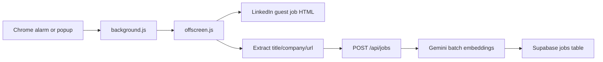
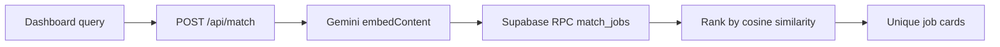
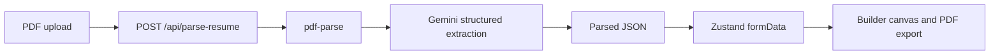
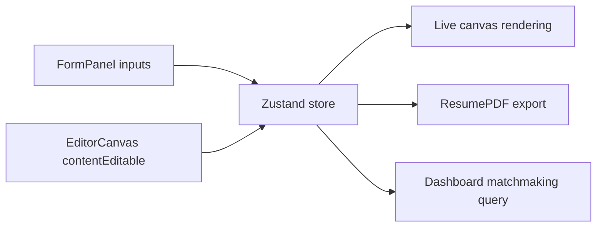

# Resuml Internals

This document describes the project as it exists in the repository today.
It is based on the source code, not on older project notes.

## 1. What This Project Is

Resuml is a Next.js application with three main product areas:

1. Marketing site
2. Job discovery dashboard
3. Resume/profile builder

The product goal is to connect a user's resume or profile to relevant jobs using vector embeddings and cosine similarity instead of only keyword search.

There is also a Chrome extension that scrapes job listings and feeds them into the app's backend.

## 2. Current Stack

## Frontend

- Next.js `16.2.4`
- React `19.2.4`
- App Router
- Tailwind CSS v4
- Framer Motion
- Zustand
- `@react-pdf/renderer`

## Backend and data

- Next.js route handlers under `src/app/api`
- Supabase
- PostgreSQL + `pgvector`
- Gemini API
- `pdf-parse`

## Extension

- Chrome Extension Manifest V3
- Background service worker
- Offscreen document for DOM parsing and scraping

## 3. Repository Layout

```text
src/
  app/
    api/
      jobs/
      match/
      parse-resume/
      search/
      vectorize-resume/
    auth/
      callback/
      login/
    builder/
    contact/
    dashboard/
    features/
    pricing/
    profile/setup/
  components/
    builder/
    dashboard/
    layout/
    ResumePDF.tsx
  store/
    useResumeStore.ts
  utils/
    supabase.ts

extension/
  background.js
  offscreen.js
  popup.js
  manifest.json

supabase_setup.sql
```

## 4. Runtime Architecture

## 4.1 Layout shells

The app uses one root layout in `src/app/layout.tsx`, then switches visual shells in `src/components/layout/AppLayout.tsx`.

There are three route modes:

- Marketing shell
  - Used for `/`, `/pricing`, `/auth/*`
  - Renders `Navbar`, page content, and `Footer`
- App shell
  - Used for dashboard-style pages
  - Renders `Sidebar`, `TopBar`, and page content
- Builder shell
  - Used for `/builder` and `/profile/setup`
  - Renders the page directly without the outer shell

This route-shell split is controlled by pathname checks in `AppLayout`.

## 4.2 Client state backbone

The central client-side state container is `src/store/useResumeStore.ts`.

It stores:

- `formData`
  - name, email, phone, website, location
  - summary, skills, experience, education, projects
  - desiredRoles, experienceLevel
- `template`
  - `modern`, `minimal`, `executive`
- `resumeVector`
  - currently present in state shape but not fully wired into flows

This Zustand store is the shared data source for:

- profile setup
- resume builder form inputs
- direct canvas editing
- dashboard matchmaking mode
- PDF export

## 4.3 Backend pattern

The backend is implemented as Next.js route handlers under `src/app/api`.

There are no separate service or repository layers yet. Most route handlers do their work inline:

- request parsing
- Supabase query or RPC call
- Gemini invocation
- response formatting

This keeps the code simple but also means logic is duplicated across routes.

## 5. Main User Flows

## 5.1 Marketing flow

Routes:

- `/`
- `/pricing`
- `/features`
- `/contact`

These pages are mostly static, client-rendered presentation pages with Framer Motion.

Their purpose is positioning and conversion, not data processing.

## 5.2 Dashboard flow

Entry point: `src/app/dashboard/page.tsx`

The dashboard has three search modes:

### Standard mode

Input:

- `query`
- `location` from UI

Execution:

- POST to `/api/search`

Behavior:

- Server filters the `jobs` table using `ilike` on `title` and `company`
- If query is blank, server returns recent jobs ordered by `created_at desc`
- Server deduplicates by `title-company`

Note:

- `location` is collected in the UI but currently ignored by the API

### Semantic mode

Input:

- free-text `query`

Execution:

- POST to `/api/match` with `{ skills: query }`

Behavior:

- Backend embeds the text with Gemini
- Backend calls the Supabase RPC `match_jobs`
- Results are ranked by cosine similarity

### Matchmaking mode

Input:

- current Zustand profile/resume data

Execution:

- Dashboard concatenates `name`, `summary`, `skills`, and `experience`
- POST to `/api/match`

Behavior:

- Same semantic matching pipeline as above
- Used as "match my profile against jobs"

If there is no profile data, the page prompts the user to go to `/profile/setup`.

## 5.3 Profile setup flow

Entry point: `src/app/profile/setup/page.tsx`

This is a four-step wizard:

1. Basic info
2. Desired roles
3. Core skills
4. Experience level

On completion:

- It builds one text string from the profile
- Sends that string to `/api/match`
- Redirects to `/dashboard?mode=matchmaking`

Important current behavior:

- The response from `/api/match` is not used
- `setResumeVector` is imported but not used
- No profile vector is persisted into Zustand
- The redirect query param is not read in the dashboard

So this flow currently works mostly as onboarding UI, not as a completed profile persistence pipeline.

## 5.4 Resume builder flow

Entry point: `src/app/builder/page.tsx`

The builder is a three-column workspace:

- Left: `FormPanel`
- Center: `EditorCanvas`
- Right: `PropertiesPanel`

### Left panel

`FormPanel` edits `summary`, `education`, `experience`, `projects`, and `skills`.

Each field writes to Zustand through `onChange`.

### Center canvas

`EditorCanvas` renders the live resume preview.

It uses `contentEditable` for direct in-place editing:

- header fields
- section body content

Changes are pushed back into the store through `handleInput`.

This is the most important interactive part of the builder: the form and canvas both edit the same shared state.

### Right panel

`PropertiesPanel` is currently visual only.

It presents future formatting controls such as:

- alignment
- font settings
- color
- skill alignment callout

At the moment it does not mutate builder state.

### Export

The builder dynamically loads `PDFDownloadLink` from `@react-pdf/renderer`.

When exporting:

- current `formData` and `template` are passed to `ResumePDF`
- a PDF is generated client-side

## 5.5 Resume parsing flow

Component: `src/components/builder/ResumeUpload.tsx`

This component:

1. accepts a PDF
2. validates type and size
3. sends it to `/api/parse-resume`
4. receives structured JSON
5. writes the parsed data into Zustand

Server route: `src/app/api/parse-resume/route.ts`

Server steps:

1. read `multipart/form-data`
2. get uploaded file
3. convert file to buffer
4. extract raw text with `pdf-parse`
5. send raw text to Gemini with a strict JSON schema prompt
6. strip markdown fences if present
7. `JSON.parse` the result
8. return structured resume data

Important current state:

- This upload component exists, but it is not mounted in `builder/page.tsx`
- The parsing backend is implemented, but not fully wired into the main builder experience

## 6. API Surface

## 6.1 `/api/search`

Purpose:

- keyword search or recent job feed

Input:

```json
{ "query": "frontend engineer" }
```

Behavior:

- query `jobs`
- `ilike` on `title` and `company`
- if empty query, order by `created_at desc`
- deduplicate by `title-company`
- return up to 15 unique jobs

## 6.2 `/api/match`

Purpose:

- semantic matching between a user text/vector and stored jobs

Input options:

```json
{ "skills": "React TypeScript frontend..." }
```

or

```json
{ "vector": [ ...1536 floats... ] }
```

Behavior:

- if `vector` is missing, create it with Gemini embedding model
- call Supabase RPC `match_jobs`
- deduplicate by `title-company`
- return up to 10 unique jobs

## 6.3 `/api/jobs`

Purpose:

- ingest jobs from the extension

Input:

```json
{
  "jobs": [
    { "title": "...", "company": "...", "url": "..." }
  ]
}
```

Behavior:

- validate basic shape
- map `url -> job_url`
- fetch existing DB rows to deduplicate
- deduplicate incoming batch
- batch-embed `title + company`
- insert jobs into Supabase

Also exposes:

- `OPTIONS` handler with permissive CORS

## 6.4 `/api/parse-resume`

Purpose:

- parse uploaded PDF into structured resume fields

Input:

- `multipart/form-data`
- `file`

Behavior:

- extract text with `pdf-parse`
- structure with Gemini Flash
- return parsed JSON

## 6.5 `/api/vectorize-resume`

Purpose:

- create one embedding from combined resume fields

Behavior:

- concatenates resume sections
- embeds them with Gemini
- returns the vector

Current state:

- implemented
- not fully integrated into the main product flow

## 7. Database Contract

The database setup is defined in `supabase_setup.sql`.

## 7.1 `jobs` table

Columns:

- `id BIGSERIAL PRIMARY KEY`
- `title TEXT NOT NULL`
- `company TEXT NOT NULL`
- `job_url TEXT NOT NULL UNIQUE`
- `embedding vector(1536)`
- `created_at TIMESTAMPTZ DEFAULT NOW()`

## 7.2 vector index

The table has an `ivfflat` index using `vector_cosine_ops`.

Purpose:

- accelerate similarity search over embeddings

## 7.3 RPC: `match_jobs`

Inputs:

- `query_embedding vector(1536)`
- `match_threshold float`
- `match_count int`

Returns:

- `id`
- `title`
- `company`
- `job_url`
- `similarity`

Logic:

- computes `1 - (jobs.embedding <=> query_embedding)`
- filters above threshold
- orders by nearest distance
- limits by count

## 7.4 cleanup schedule

The SQL also enables `pg_cron` and schedules deletion of jobs older than 30 days.

That is intended to keep the jobs table small and fresh.

## 8. Chrome Extension Architecture

The extension is a separate ingestion agent.

## 8.1 Files

- `manifest.json`
- `background.js`
- `offscreen.js`
- `popup.js`
- `popup.html`
- `offscreen.html`

## 8.2 Background service worker

`background.js`:

- creates a repeating alarm
- responds to manual popup messages
- sets up the offscreen document
- resumes pending scrapes via storage state

## 8.3 Offscreen scraper

`offscreen.js`:

- receives `START_HUNT`
- scrapes LinkedIn guest job search HTML
- parses DOM with `DOMParser`
- falls back to regex extraction if needed
- deduplicates locally
- stores jobs and status in `chrome.storage.local`
- POSTs jobs to `http://localhost:3000/api/jobs`

## 8.4 Popup

`popup.js`:

- reads jobs/status/last run from storage
- updates UI
- triggers manual scrape with a query

## 8.5 Practical role

This extension is the project's current job source.

Without it, the dashboard depends on pre-existing rows in the `jobs` table.

## 9. Styling System

Global tokens live in `src/app/globals.css`.

Key design variables:

- `--bg`
- `--surface`
- `--border`
- `--text-primary`
- `--text-muted`
- `--accent`
- `--accent-secondary`
- `--accent-light`

Fonts:

- sans: `Geist`
- mono: `Geist Mono`

The visual style is a light, clean, productized UI with a blue accent system.

## 10. Auth Model

Client auth is handled with Supabase browser auth helpers.

Key pieces:

- `src/utils/supabase.ts`
  - browser client
- `src/app/auth/login/page.tsx`
  - starts Google OAuth
- `src/app/auth/callback/route.ts`
  - exchanges code for session via server client

Shared auth-aware UI:

- `AuthButtons`
- `UserMenu`

Current provider state:

- Google is wired
- GitHub button exists visually but is not connected

## 11. Function and Module Responsibilities

## App-level modules

- `src/app/layout.tsx`
  - root HTML/body shell
  - loads fonts and wraps everything in `AppLayout`
- `src/components/layout/AppLayout.tsx`
  - chooses route shell

## Dashboard modules

- `src/app/dashboard/page.tsx`
  - owns search mode state, loading state, fetched jobs, and search orchestration
- `src/components/dashboard/SearchSection.tsx`
  - search UI and mode selector
- `src/components/dashboard/JobCard.tsx`
  - renders one job result card
- `src/components/dashboard/SkeletonCard.tsx`
  - loading placeholders

## Builder modules

- `src/app/builder/page.tsx`
  - builder workspace composition
- `src/components/builder/FormPanel.tsx`
  - accordion-driven form editing
- `src/components/builder/EditorCanvas.tsx`
  - direct resume editing on preview canvas
- `src/components/builder/PropertiesPanel.tsx`
  - future formatting controls, currently mostly static
- `src/components/builder/TemplateSelector.tsx`
  - template gallery overlay
- `src/components/builder/ResumeUpload.tsx`
  - resume import and autofill
- `src/components/ResumePDF.tsx`
  - PDF rendering

## Auth/layout modules

- `src/components/layout/Navbar.tsx`
  - top navigation for marketing shell
- `src/components/layout/Sidebar.tsx`
  - app navigation
- `src/components/layout/TopBar.tsx`
  - app top search/notification/user area
- `src/components/layout/Footer.tsx`
  - marketing footer
- `src/components/layout/AuthButtons.tsx`
  - sign-in state switcher
- `src/components/layout/UserMenu.tsx`
  - profile dropdown and sign out

## Utility/state modules

- `src/store/useResumeStore.ts`
  - single shared client state for resume/profile/builder/matchmaking
- `src/utils/supabase.ts`
  - browser Supabase client

## 12. Data Flow Diagrams

## 12.1 Job ingestion



## 12.2 Semantic search



## 12.3 Resume parsing



## 12.4 Builder editing



## 13. Environment and setup assumptions

The code assumes these env vars exist:

- `NEXT_PUBLIC_SUPABASE_URL`
- `NEXT_PUBLIC_SUPABASE_ANON_KEY` or `NEXT_PUBLIC_SUPABASE_PUBLISHABLE_KEY`
- `GEMINI_API_KEY`

Local ingestion also assumes:

- app running at `http://localhost:3000`
- Supabase configured with the `jobs` table and `match_jobs` RPC

## 14. Current Gaps and Inconsistencies

These are the main implementation gaps visible in the repo today.

## 14.1 Stale documentation

`projectreport.md` says Next 14, but the real project is on Next 16.

## 14.2 Broken or incomplete route links

The UI links to routes that do not exist yet:

- `/jobs/[id]`
- `/saved`
- `/analytics`
- `/settings`
- `/resources`
- `/matching`
- `/about`
- `/privacy`
- `/terms`

These links are present in the dashboard, sidebar, navbar, or footer.

## 14.3 Builder integration gaps

- `ResumeUpload` exists but is not mounted
- `showGallery` exists but there is no visible trigger to open it
- `isTailoring` is set from query params but not used for behavior
- `PropertiesPanel` is mostly visual and not wired

## 14.4 Type import issue

`TemplateSelector.tsx` imports `ResumeTemplate` from `@/app/builder/page`, but the builder page does not export that type.
The canonical type is in `useResumeStore.ts`.

## 14.5 Profile flow incompleteness

- `setResumeVector` is imported but unused
- `/profile/setup` calls `/api/match` but does not persist the resulting vector
- dashboard does not react to `?mode=matchmaking`

## 14.6 API/client boundary issue

`/api/jobs` imports `supabase` from `src/utils/supabase.ts`, which creates a browser client.
That utility is not the right abstraction for server routes.

Other API routes create their own Supabase client directly, so this route is inconsistent with the rest of the backend.

## 14.7 Search limitations

- `/api/search` ignores `location`
- standard search only considers `title` and `company`
- semantic search only uses free text, not stored user vectors

## 15. Suggested Near-Term Cleanup

If this project is going to be extended, the highest-value cleanup is:

1. Add a server-only Supabase utility and use it in all route handlers
2. Fix the broken `ResumeTemplate` import
3. Mount `ResumeUpload` in the builder
4. Persist and use `resumeVector`
5. Implement or remove dead links
6. Split API logic into reusable services
7. Update stale docs and README

## 16. Fast Mental Model

If you need one short summary:

- The extension fills the jobs database
- Gemini turns jobs and resumes into vectors
- Supabase `pgvector` handles similarity search
- Zustand is the shared client-side source of truth
- The builder edits that state
- The dashboard searches against that state or user-entered text

That is the core of the system.
